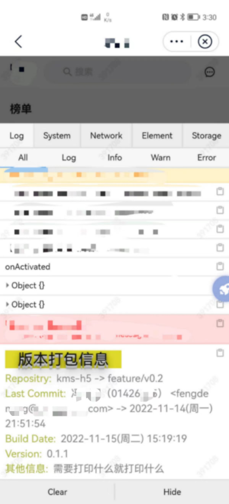

# inject-project-info

> 一个工具类插件，分别提供了 **_webpack 插件_** 版本和**_vite 插件_**版本。打包项目时自动注入项目打包信息，可在控制台日志查看，方便定位版本问题。项目打包信息包括：git 仓库信息、打包时间和用户指定的任意信息。

😈 前提： 在配置文件中引入使用插件，打包项目时(`npm run build`)，插件会自动将项目信息的代码通过 scirpt 标签动态注入到打包产物的 html 中。所以也要求业务代码的打包产物是有 html 文件的。（业务项目都有吧 😏。。。）

## INSTALL

```js
 // npm
 npm i inject-project-info -D
 // pnpm
 pnpm add inject-project-info -D
```

## USAGE

> 结合打包工具 webpack 和 vite 使用，分别提供对应的插件。

```ts
export interface Options {
  isLog?: boolean;
  timeout?: boolean | number;
  isLogLastCommitMessage?: boolean;
  extraLogInfo?: IExtraLogInfo[];
}

export interface IExtraLogInfo {
    label: string;
    value: string;
}

// webpack plugin
new InjectProjectInfoWebpackPlugin(options: Options),
// vite plugin
injectProjectInfoVitePlugin(options: Options),

```

### 1. 结合 webpack 使用

#### 1.1. webpack 构建的项目使用示例：

```js
// webpack.config.js (webpack配置文件)

const InjectProjectInfoWebpackPlugin = require('inject-project-info/webpack');

module.exports = {
  // ...其他配置
  plugins: [
    new InjectProjectInfoWebpackPlugin({
      isLog: process.env.NODE_ENV !== 'development', // 只在生产模式注入项目信息
    }),
  ],
};
```

#### 1.2. vue-cli 创建的项目（底层也是基于 webpack 构建工具）使用示例：

```js
// vue.config.js (配置文件)

const InjectProjectInfoWebpackPlugin = require("inject-project-info/webpack");

module.exports = {
  // ...其他配置
  configureWebpack: () => {
    new InjectProjectInfoWebpackPlugin({
      isLog: process.env.NODE_ENV !== "development", // 只在生产模式注入项目信息
    }),
  },
};
```

#### 2. 结合 vite 使用

#### vite 构建的项目使用示例：

```js
// vite.config.js (vite配置文件)

import { defineConfig } from 'vite';
import injectProjectInfoVitePlugin from 'inject-project-info/vite';

export default defineConfig({
  // ...其他配置
  plugins: [
    injectProjectInfoVitePlugin({
      isLog: !process.argv.includes('development'), // 只在生产模式注入项目信息。
    }),
  ],
});
```

特别说明：因为 vite 项目在 vite.config.js 获取 process.env.NODE_ENV 为 undefined，需要使用其他方法判断是否是生产环境。
可使用 cross-env 定义环境变量，或更简单点，在 package.json 的生产构建命令，必须显示指定--mode prodution 参数，则使用 process.argv.includes('production')判断是否是生产环境。示例如下：

```json
// package.json示例
{
  "scripts": {
    "dev": "vite --mode development",
    "build": "vue-tsc && vite build --mode production",
    "preview": "vite preview"
  }
}
```

## 参数说明

### options

| 参数名称               |                                                                                             说明 |              类型 | 默认值 |
| :--------------------- | -----------------------------------------------------------------------------------------------: | ----------------: | -----: |
| isLog                  |               控制插件是否注入项目打包信息，并打印到控制台。<br>推荐在生产环境开启，开发环境关闭 |           boolean |   true |
| timeout                |                        控制控制台是否延迟打印打包信息。传 false 可关闭，传数值设置延迟 x(ms)打印 | boolean 或 number |   2000 |
| isLogLastCommitMessage |                                  是否打印最新提交记录的 commit message。考虑信息敏感原因建议关闭 |           boolean |  false |
| extraLogInfo           | 用户额外指定的打印信息。比如有维护 package.json 的版本号的项目，可打印当前 package.json 的版本号 |   IExtraLogInfo[] |     [] |

### extraLogInfo

| 参数名称 |         说明 |   类型 | 默认值 |
| :------- | -----------: | -----: | -----: |
| label    | 信息左边标题 | string |     '' |
| value    | 信息右边内容 | string |     '' |

## 效果

包括以下信息：

- 项目名称 -> git 分支
- 最近一次提交记录：提交人 -> 提交时间（commit message 可能为敏感信息不建议不展示）。
- 打包时间
- 用户额外指定的打印信息

下方代码示例及其对应的效果图展示如下：

```js
new InjectProjectInfoWebpackPlugin({
  timeout: 3000, // 延迟3s打印
  isLog: process.env.NODE_ENV !== "development", // 只在开发环境开启
  // isLogLastCommitMessage: true,
  extraLogInfo: [ // 用户额外指定的打印信息
    {
      label: "Version",
      value: require("./package.json").version,
    },
    {
      label: "其他信息",
      value: "需要打印什么就打印什么",
    },
  ],
}),
```



## Todos

1. 内置实现打印项目构建依赖实际版本。
2. commit 信息打印 commit hash
